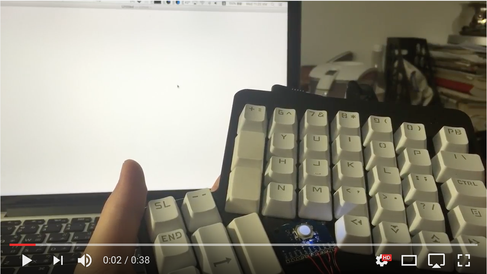

# Blackberry Mini Trackball
This project is to demo how to use blackberry mini trackball.

### [Demo Video](https://www.youtube.com/watch?v=pNDsID4fOzs)

## Hardware
### Arduino leonardo Pro Micro

picture from [apc.com](http://apcmag.com/arduino-project-usb-foot-operated-mouse-switch.htm/)

In fact, all arduino can use the blackberry mini trackball module, but I want to simulate mouse event, so I use leonardo pro micro.

### Blackberry Mini Trackball

picture from [aliexpress.com](http://www.aliexpress.com/item-img/ICSH044A-ICSTATION-Blackberry-Trackball-Breakout-Board/32568111155.html?spm=2114.12010108.1000017.2.LvHySX)

This module also contains resisters, so to to ligth the LED on the board, simple connect your arduino pin, and drive it to 3.3V.

## Pin definition

| trackball module | arduino |
|------------------|---------|
| VCC              | VCC     |
| GND              | GND     |
| BTN              | 2       |
| RHT              | 3       |
| LFT              | 4       |
| DWN              | 5       |
| UP               | 6       |
| WHT              | 7       |

## Mouse Move
I made a design to make the mouse move more confortable, which is learn from the touchpad on macbook.

If you scroll slowly, the mouse is also move slowly, but if you scroll very hard, the mouse will move with an nonlinear, longer distance. You can check this feature in demo video.